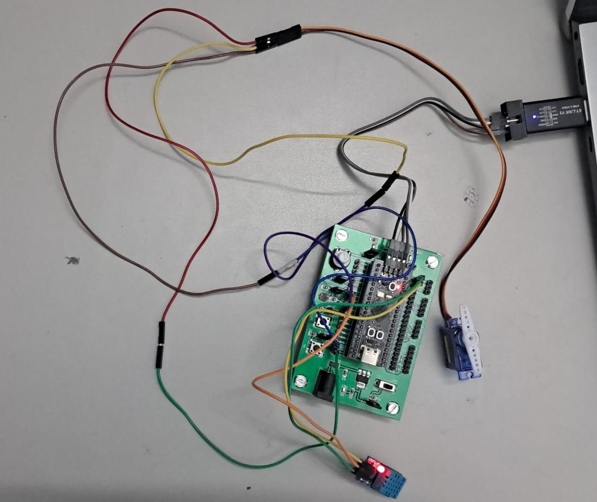

# Embedded Systems Project Documentation

**Department of Computer Science and Engineering**  
Amrita School of Computing,  
Amrita Vishwa Vidyapeetham, Coimbatore, India 

## Course: 19CSE303 Embedded Systems

### Team Members:
- CB.EN.U4CSE22424 Nadimpalli Venkata Sai Kiran Varma
- CB.EN.U4CSE22440 Soma Siva Pravallika
- CB.EN.U4CSE22444 Suman Panigrahi
- CB.EN.U4CSE22457 Sravani Oruganti

---

### Overview

This project consists of two main embedded system implementations on the STM32 microcontroller:
1. **Temperature and Motion Detection System** using GPIO, DHT11, and LED control.
2. **Servo Motor Control** using PWM via Timer 2.

The code leverages low-level register manipulation to control GPIO, read sensor data, and generate PWM signals, providing insights into direct hardware-level programming on STM32.

---

## Code 1: Temperature and Motion Detection System

This system monitors temperature using a DHT11 sensor and detects motion with a PIR sensor. The onboard and external LEDs respond to sensor data to provide visual indications of temperature thresholds and motion detection.

### Features:
- **Temperature Monitoring**: Reads temperature data from DHT11 on GPIO PA2 and indicates high temperature by blinking an LED.
- **Motion Detection**: Uses a PIR sensor on PA0 to detect motion, turning on an LED when motion is present.
- **Light Detection**: Reads light sensor data on PA1 and toggles an external LED on PB9 based on ambient light.
- **LED Control**: Controls LEDs on PC13, PC14, and PB9 according to sensor inputs.

### Code Walkthrough:

- **GPIO Setup**:
  - **PA0** (PIR Sensor), **PA1** (Light Sensor), and **PA2** (DHT11 Sensor) are configured as inputs.
  - **PC13** (onboard LED), **PC14** (temperature indicator LED), and **PB9** (external LED) are configured as outputs.
  
- **DHT11 Sensor Interface**:
  - `readDHT11()`: Reads temperature data from DHT11, converting the integer part of the temperature to tenths of degrees.

- **Main Loop**:
  - Reads sensor data for motion, light, and temperature.
  - Controls LEDs based on conditions:
    - **PC13**: Lights up on motion detection.
    - **PB9**: Flashes when motion is detected in dark conditions.
    - **PC14**: Blinks if temperature exceeds the predefined threshold (27.3 °C).

```c
#include "stm32f4xx.h"

// Threshold temperature in tenths of a degree (27.3 °C)
const int threshold = 273;

void delay(int time) {
    for (int i = 0; i < time; i++) {
        __NOP();
    }
}

// DHT11 reading logic
int readDHT11(void) { ... }

int main(void) { ... }
```

---

## Code 2: Servo Motor Control

This system controls a servo motor using PWM generated by Timer 2 on GPIO PA5. It sets the servo angle by adjusting the PWM pulse width to match the specified angle.

### Features:
- **PWM Setup on Timer 2**: Configures Timer 2 to generate PWM on PA5, with a frequency of 50 Hz.
- **Angle Control**: Sets servo angle from 0° to 180° by adjusting pulse width using `Servo_SetAngle()` function.

### Code Walkthrough:

- **TIM2 PWM Initialization**:
  - `TIM2_PWM_Init()`: Sets up PWM on PA5 with a prescaler and auto-reload register to achieve the desired 50 Hz frequency.
  
- **Servo Angle Setting**:
  - `Servo_SetAngle()`: Adjusts the pulse width based on the desired angle, clamping it between 0° and 180°.

```c
#include "stm32f4xx.h"

void TIM2_PWM_Init(void);
void Servo_SetAngle(uint8_t angle);

int main(void) {
    TIM2_PWM_Init(); // Initialize Timer 2 for PWM
    Servo_SetAngle(90); // Set servo to 90 degrees
    while (1); // Loop indefinitely
}

void TIM2_PWM_Init(void) { ... }
void Servo_SetAngle(uint8_t angle) { ... }
```

---

### Components Used:
- **Microcontroller**: STM32F401CCU6 Minimum System Board
- **Sensors**: DHT11 Temperature & Humidity Sensor, PIR Motion Sensor, Light Sensor
- **LEDs**: Onboard LED (PC13), Indicator LEDs (PC14, PB9)
- **Servo Motor**: TowerPro SG90 180° Mini Servo

---

### How to Build and Deploy
1. **Environment Setup**:
   - STM32CubeIDE or Keil uVision with STM32 libraries.
2. **Compilation**:
   - Compile the code and flash it to the STM32 board.
3. **Execution**:
   - Run the code on the board and observe the behavior of LEDs and servo motor.

<!--- ---

### Future Improvements
- **Modularize code** to separate sensor and actuator functions for better readability.
- **Implement error handling** for sensor reading issues or servo control failures.
- **Add low-power modes** to optimize power consumption during idle states.
--->
---

# Servo Motor Control

The servo motor's angle is controlled using PWM signals. Here's a visual representation of the setup:



---

### License
This project is licensed under the MIT License.
